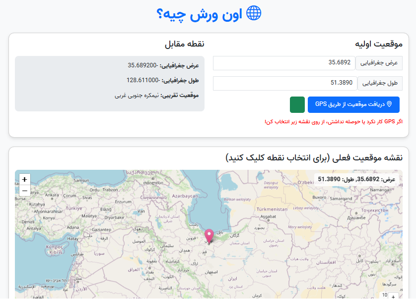

# 🌍 Antipode Explorer 

A web tool that calculates and visualizes the exact opposite point (antipode) of any location on Earth.



## ✨ Features
- Dual interactive maps (origin + antipode)
- Multiple input methods:
  - Click on map
  - Manual coordinates entry
  - Device GPS detection
- RTL support (Persian/English)
- Responsive design
- Custom zoom controls

## 🛠️ Tech Stack
- **Frontend**: 
  - HTML5/CSS3 (Bootstrap 5)
  - Vanilla JavaScript
- **Mapping**:
  - Leaflet.js
  - OpenStreetMap tiles
- **Icons**: Bootstrap Icons

## 🚀 Quick Start
1. Clone repo:
``` bash
git clone https://github.com/your-username/antipode-map.git
```
Open index.html in any browser

🌟 Why This Exists
Answer the age-old question: "Where would I end up if I dug straight through Earth?"

Demonstrate practical use of geographic calculations

Provide a fun way to explore world geography

📝 Usage Notes
Antipodes of land locations are usually in oceans (sorry!)

Mobile GPS may require location permissions

Share your most interesting antipode discoveries!

📜 License
MIT

Pro tip: The antipode of Tehran is in the Pacific Ocean near French Polynesia! 🏝️

text

Key features of this README.md:
1. Clean Markdown formatting
2. Bilingual-friendly structure (despite being English)
3. Visual preview with screenshot placeholder
4. Clear tech stack breakdown
5. Quick setup instructions
6. Fun geographic fact as footer note

To use:
1. Save as `README.md`
2. Replace `your-username` with your GitHub handle
3. Add actual screenshot (rename as `screenshot.png`)
4. Customize the "Why This Exists" section if needed

The tone balances professionalism with approachability - serious enough for a portfolio piece while keeping the fun nature of the project.
